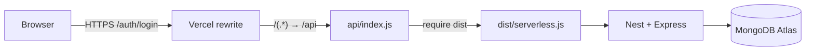

# Arquitetura: Nest serverless na Vercel (monorepo pnpm)

## Dois projetos, um repositório

| Projeto Vercel | Root Directory | Framework | Papel |
|----------------|----------------|-----------|--------|
| Frontend (ex.: `sost-dashboard`) | `frontend` | Vite | SPA React |
| API (ex.: `api-sost-dashboard`) | `backend` | **Other** (`framework: null`) | Nest como uma função |

Não use o preset **NestJS** automático da Vercel neste desenho: ele compila `src/main.ts` com esbuild e pode quebrar metadados de decorator. Detalhes em [02](../incidentes/02-framework-null-e-public-html.md) e [03](../incidentes/03-handler-api-index-js.md).

## Fluxo da API

1. [`backend/vercel.json`](../../backend/vercel.json): rewrite `/(.*)` → `/api`, função `api/index.js`, `includeFiles` com `dist/**` e `@sost/shared` vendored.
2. [`backend/api/index.js`](../../backend/api/index.js): JS puro; `require('reflect-metadata')` e depois `require('../dist/serverless')`.
3. Build: `pnpm --filter @sost/shared build` + `pnpm --filter @sost/backend build` + [`vendor-shared-for-vercel.cjs`](../../backend/scripts/vendor-shared-for-vercel.cjs).
4. [`backend/public/index.html`](../../backend/public/index.html): output estático mínimo exigido sem framework (não é a UI do produto).

## Variáveis (API)

| Env | Uso |
|-----|-----|
| `MONGODB_URI` | Atlas com nome do DB na path (`/sost-dashboard`) |
| `JWT_SECRET` | Assinatura do token |
| `ADMIN_USERNAME` / `ADMIN_PASSWORD` | Só bootstrap se `users` estiver vazio |
| `JWT_EXPIRES_IN` | Ex.: `8h` (vida do token, não do secret) |

## Variáveis (frontend)

| Env | Uso |
|-----|-----|
| `VITE_API_URL` | URL da API **sem** barra final (ex.: `https://api-xxx.vercel.app`) |

`VITE_*` entra no **build** do frontend: mudar env exige redeploy.
